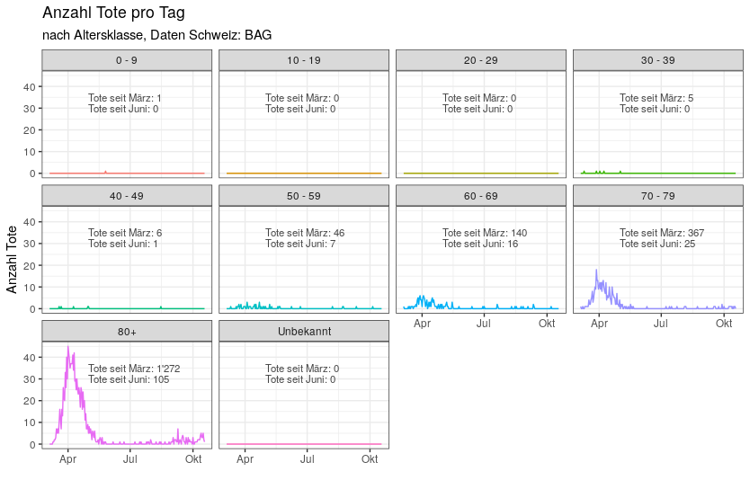

# number of cases and deaths

# hospital beds, intensive care beds and COVID-19 cases

# data

archived BAG data: https://www.functor.xyz/covid_19b/

props to https://github.com/openZH/covid_19/issues/185#issuecomment-604267155
